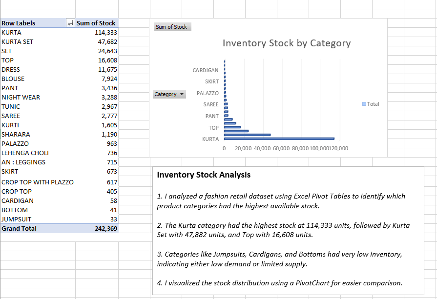

# Retail-Stock-Analysis-Excel
Basic inventory analysis project using Excel Pivot Tables

# 🧵 Retail Stock Analysis – Excel Project

This is a beginner-friendly Excel data analysis project using Pivot Tables and Charts.

## 📊 Objective
To analyze a fashion retail dataset and identify product categories with the highest available inventory.

## 🔍 Key Insights
- **Kurta** had the highest stock with **114,333** units.
- **Kurta Set** followed with **47,882**, and **Top** with **16,608** units.
- Categories like **Jumpsuit**, **Bottom**, and **Cardigan** had the **lowest stock**, indicating either low demand or limited supply.

## 📌 Tools Used
- Microsoft Excel (Pivot Tables, PivotCharts)
- Basic data interpretation

## 📸 Preview

## 💡 What I Learned
- How to use Pivot Tables to summarize large datasets.
- How to create a meaningful chart to visualize inventory distribution.
- Basic storytelling with data for business insight.

---
